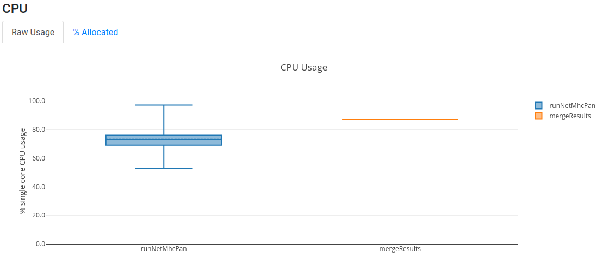

# Nextflow workshop

Topics:

- Part I: learning to use Nextflow
  - [How to install Nextflow](#how-to-install-nextflow)
  - [Hello world!](#hello-world)
  - [Using Nextflow in a distributed environment](#using-nextflow-in-a-distributed-environment)
  - [Running community contributed workflows](#running-community-contributed-workflows)


- Part II: learning to write a Nextflow workflow
  - [Input and output](#input-and-output)
  - [Sequential and parallel processing](#sequential-and-parallel-processing)
  - [Define computational requirements](#define-computational-requirements)
  

  
To start the workshop clone this repository and move into the tutorial folder.


# Part I: learning to use Nextflow

## How to install Nextflow

Requirements:
- Unix system with bash>=3.2. Windows is not supported out of the box
- Java >=8, <=15. Different servers may have different default Java versions, in order to avoid potential trouble load this module `module load java/11.18.09`

At the time of this writing the latest Nextflow stable release is 20.10.0.

There are two options: 1) use the Nextflow installation available for all users or 2) install a local copy of Nextflow. Although option 1 is preferred to avoid multiple installations of the same thing, you may want to use option 2 to try some nex functionality in a pre-release as the development is quite active and the footprint is not massive neither.

### Option 1: using pre-installed Nextflow

Nextflow is installed under `/code/nextflow/nextflow`, try it as follows:
```
$ /code/nextflow/nextflow -version
      N E X T F L O W
      version 20.10.0 build 5430
      created 01-11-2020 15:14 UTC (16:14 CEST)
      cite doi:10.1038/nbt.3820
      http://nextflow.io
```

### Option 2: install your own Nextflow

To install a local copy of Nextflow just run the following: 
```
$ wget -qO- https://get.nextflow.io | bash
```
This will create a `nextflow` executable in your working folder.

### Add Nextflow to your path
For the sake of simplicity, you may want to add the Nextflow executable (whichever it is you are using) to your path. There are many alternatives to do this, this is one.

- Open the file `~/.bash_profile` with your favorite editor
- Add the line `PATH=/code/nextflow:$PATH`
- Now reload your session configuration: `source ~/.bash_profile`
- Confirm that you can now run without providing any path `nextflow -version`

### References

- Getting started guide: https://www.nextflow.io/docs/latest/getstarted.html
- NextFlow GitHub https://github.com/nextflow-io/nextflow


## Hello world!

Let's now run a hello world Nextflow workflow. We will use the file `01_hello_world.nf`.
```
#!/usr/bin/env nextflow

cheers = Channel.from 'Bonjour', 'Ciao', 'Hello', 'Hola'

process sayHello {
  echo true
  input: 
    val x from cheers
  script:
    """
    echo '$x world!'
    """
}
```

The above will run four jobs. The first will print `Bonjour world!`, the second `Ciao world!` and so on. Each of this jobs may run in parallel (or distributed).

Now run the workflow:
```
$ nextflow 01_hello_world.nf 
N E X T F L O W  ~  version 20.04.1
Launching `01_hello_world.nf` [friendly_lamarr] - revision: d3a65fa206
executor >  local (4)
[33/978e5c] process > sayHello (4) [100%] 4 of 4 ✔
Bonjour world!

Ciao world!

Hello world!

Hola world!
```

**NOTE**: if you previously configured your Nextflow to run using slurm you may want to temporarily rename your config file `~/.nextflow/config` to something else, to avoid sending these jobs to slurm. If you did not you don't have to do anything!

What happened above is that the main process created a channel in memory with four elements, each of those elements was sent to a child process that run the `sayHello` process. Once all the child processes finished, the main process collected the results and finished. But don't take my word for it!

### Generating execution reports

Run now the same workflow as follows: `$ nextflow 01_hello_world.nf -with-timeline`
This will run as before, but it will also create a file named `timeline.html` which shows the four processes executing in parallel.


There are other three options that can be useful for documentation purposes or to measure the performance and the resource utilization of your workflow. All of this can be combined.

Try this: 
```
$ nextflow 01_hello_world.nf -with-timeline -with-report -with-trace -with-dag dag.png
```

You should see three new files: `report.html`, `trace.txt` and `dag.png`. Each of this can be useful in different contexts.

#### Let me introduce you to the Nextflow configuration

If you want to avoid having to type in all the reports you need or worse needing to rerun a workflow in order to obtain a report which you forgot, you can just configure all reports by default. You will need to create a Nextflow configuration file named `~/.nextflow/config` and add the following lines to it:
```
timeline.enabled = true
report.enabled = true
trace.enabled = true
dag.enabled=true
```

Now every time, you run nextflow you will get all these reports we have been looking at.

More on the configuration soon...

### Logs

Nextflow keeps a record of all runs, it can be accessed as follows:
```
$ nextflow log
TIMESTAMP          	DURATION	RUN NAME         	STATUS	REVISION ID	SESSION ID                          	COMMAND                                                                          
2021-04-07 14:47:12	1.9s    	big_ptolemy      	OK    	d3a65fa206 	bc20f02b-aa06-42ba-a10f-9fd90007770d	nextflow 01_hello_world.nf                                                          
2021-04-07 14:55:32	2.8s    	cheeky_linnaeus  	OK    	d3a65fa206 	6ccdc4a1-699c-4e8c-b9c2-7c1cd5b33a63	nextflow 01_hello_world.nf -with-timeline                                           
2021-04-07 15:10:21	3.5s    	agitated_hypatia 	OK    	d3a65fa206 	8032f079-bdd4-4e8b-92fb-3c60bd18ba11	nextflow 01_hello_world.nf -with-timeline -with-report -with-trace -with-dag dag.png
```

Each run is assigned a random "memorable" name such as `cheeky_linnaeus`. If you were awake you may have noticed that a new folder named `work` was created. Inside this folder, every process run by Nextflow gets a subfolder, that means in our hello world example, four subfolders for each run. You can track this as follows:
```
$ nextflow log cheeky_linnaeus
/nextflow_workshop/work/e4/accb716f3bebfbf11c1adda68713d0
/nextflow_workshop/work/3d/d1d4d951941c2302d1d0d6d0b88acc
/nextflow_workshop/work/64/00651056762621376658ac547fb0f5
/nextflow_workshop/work/ca/3909dbe14baaa0c207d1d3263ee678
```

But what do these folders contain?
```
$ ls -a /nextflow_workshop/work/e4/accb716f3bebfbf11c1adda68713d0
.  ..  .command.begin  .command.err  .command.log  .command.out  .command.run  .command.sh  .command.trace  .exitcode
```

There are a lot of things here, but the most relevant for now are:
- `.command.log` which contains the standard output of your process
- `.command.err` which contains the standard error of your process
- `.command.sh` which contains the code that your process ran

See for instance:
```
$ cat /nextflow_workshop/work/e4/accb716f3bebfbf11c1adda68713d0/.command.sh 
#!/bin/bash -ue
echo 'Hola world!'

$ cat /nextflow_workshop/work/64/00651056762621376658ac547fb0f5/.command.sh 
#!/bin/bash -ue
echo 'Bonjour world!'
```

This will be a valuable resource to debug complex workflows. If you move in the directory and try to execute `source .command.sh`, it would reproduce any existing error in a process.

**HINT**: in Tronland the file system under `/flash` corresponds to a faster SSD disk, it would be a good idea to use a location under `/flash` as the Nextflow working folder. For this there are two options: 1) run Nextflow from within a folder under `/flash` or 2) explicitly specify a working folder under `/flash` to Nextflow using the `--work-dir` parameter.

### References

- Original hello world repository: https://github.com/nextflow-io/hello
- Tracing and visualising Nextflow https://www.nextflow.io/docs/latest/tracing.html


## Using Nextflow in a distributed environment

In order to distribute processes in our cluster Nextflow needs to negotiate with slurm every time and in order for that to happen we need to come back to our configuration.

Open the file `~/.nextflow/config` and, without removing the lines you previously added, add the following:

```
profiles {
    standard {
        process {
            executor = 'slurm'
            clusterOptions = '--account=*****'
        }
    }
    test {
        process.executor = 'local'
    }
}
```

This introduces the concept of profile to the configuration. In this case we have two profiles of which one is specific to our Slurm cluster.
- `standard` uses the default slurm queue. This is also the default profile in Nextflow, not for being the first, but for being named standard.
- `test` does not use slurm, this would reproduce the behaviour we have been using up until now in this workshop, it uses the processors available in the server where nextflow is running.

Beware that our cluster requires that the user name is specified in the `--account` parameter, copy this configuration and fill in your user name.

**NOTE**: the field `clusterOptions` can receive any of the parameters passed to `sbatch` or `srun`, like `-x server1,server2`.
**NOTE 2**: comments in the config file are like Java or c comments, single lines starting with `//` or multiple lines between `/*` and `*/`.
**NOTE 3**: you can configure the names of the processes sent to slurm using the following directive in the config file `executor.jobName = { "$task.process-$task.tag-12345" }`

Now, let's run the hello world example but executing it in the cluster:
```
$ nextflow 01_hello_world.nf
N E X T F L O W  ~  version 20.04.1
Launching `01_hello_world.nf` [friendly_cantor] - revision: d3a65fa206
executor >  slurm (4)
[20/7f9f36] process > sayHello (4) [100%] 4 of 4 ✔
Ciao world!

Hello world!

Bonjour world!

Hola world!
```

If you want to use a different profile than the standard, use `$ nextflow 01_hello_world.nf -profile covid`.

### Who runs the Nextflow daemon?

A typical workflow may run for hours or days, a slurm cluster is intended to manage this long running tasks appropriately. But the Nextflow process that monitors the execution of all jobs and that in the end emits reports and results also needs to run through all this time. Thus, this process needs to run in a stable environment.

I have used two different solutions: 1) run Nextflow as a slurm job and 2) run Nextflow in a screen session.

#### Run Nextflow as a slurm job

Create a file named `01_run_hello_world.sh`:
```
#!/bin/bash

module load java/11.18.09
nextflow /nextflow_workshop/01_hello_world.nf
```

Now send to slurm with the following command:
```
$ sbatch --account=***** --mem=1G -n 1 01_run_hello_world.sh
```

#### Run Nextflow as a screen

Just connect to a screen session and run the script:
```
$ screen
$ chmod +x 01_run_hello_world.sh
$ ./01_run_hello_world.sh
```

To detach from the screen session ctrl+A+D.

### References

- Nextflow configuration documentation https://www.nextflow.io/docs/latest/config.html
- A screen tutorial may be handy to master this useful tool https://linuxize.com/post/how-to-use-linux-screen/

## Running workflows contributed by the community

Nextflow itself is open source and there are some open source intitiatives to share analysis workflows, the repository Awesome Nextflow from the Nextflow authors contains quite a lot https://github.com/nextflow-io/awesome-nextflow. Another quite popular initiative is NF-core https://github.com/nf-core. And of course our shy contribution to the community, TronFlow.

Nextflow provides mechanisms to facilitate the use of workflows without the need of an installation. Our original hello world workflow is in a public GitHub repository https://github.com/nextflow-io/hello.

Run the hello world workflow as follows:
```
$ nextflow run nextflow-io/hello
```

or 

```
$ nextflow run https://github.com/nextflow-io/hello
```

Notice that we call `nextflow run` instead of just `nextflow` and then we provide the name of the GitHub team/user followed by the name of the repository.

The only requirement to run a workflow contained in a repository is that the workflow is written in a file named `main.nf`.

### Worflow versioning

Making use of GitHub tags and releases, we can run a specific release of a Nextflow workflow. In the case of hello world there are two versions `v1.1` and `v1.2`. By default the latest version will run but we can specify a different version as follows:

```
$ nextflow run nextflow-io/hello -r v1.1
```

**HINT**: defining the version explicitly will facilitate the reproducibility of results in the future in case that a given workflow evolves.

### Using a private GitLab as a source of pipelines

If your private Gitlab provider supports HTTPS protocol first you will need to create an API access token from your Gitlab 
account https://gitlab.mine/-/profile/personal_access_tokens. Make sure you tick the API access box, copy the token.

Then you will need now to create a file named `~/.nextflow/scm` with this content
```
providers {
    mygitlab {
        server = 'https://gitlab.mine/'
        platform = 'gitlab'
        user = '******'
        password = '******'
        token = '******************'
    }
}
```

Because this file contains both an access token and your password you will want to make it only readable by you.
```
chmod 400 ~/.nextflow/scm
```

Now you should be able to use Nextflow pipelines published in out internal Gitlab using `-hub mygitlab`:
```
nextflow run -hub mygitlab tron/tronflow-mutect2 -r v0.1.0 --help
```

If your private Gitlab does not support HTTPS protocol then pull the desired workflow manually using SSH:
```
git clone git@gitlab.rlp.net:tron/tronflow-mutect2.git
```
- Run the workflow referring to the folder where the workflow was cloned:
```
nextflow run tronflow-mutect2 --help
```
or as an absolute folder:
```
nextflow run /home/priesgo/test_nextflow/tronflow-mutect2 --help
```

### References

- Pipeline sharing https://www.nextflow.io/docs/latest/sharing.html


# Part II: learning to write a Nextflow workflow

## Input and output

Let's add something more meaningful to our hello world workflow. 
Most workflows will need to be able to receive inputs from the user and provide outputs in exchange.

### Output

The output can be stored in files, we will modify our workflow to write the greeting to a file, this is in the file `02_output_files.nf`.

```
#!/usr/bin/env nextflow

cheers = Channel.from 'Bonjour', 'Ciao', 'Hello', 'Hola'

process sayHello {
  input: 
    val x from cheers

  output:
   file "${x}.txt" into cheers_file

  script:
    """
    echo '$x '\$USER'!' > ${x}.txt
    """
}
```

Our echo command is now printing its results into a file named after the input and this same file name is declared in the output section.

Also, notice that we have replaced the word `world` by the user name stored in the environment variable `$USER`. 
Because user is a system environment variable and not a nextflow variable we need to escape the $ sign.

**IMPORTANT**: notice that we use the variable `$x` twice. The first time we use it just as `$x`
 while the second it is between curly braces `${x}`. 
Curly braces are used in bash optionally to resolve ambiguities within the name of the variable.

Run now: `nextflow 02_output_files.nf`

OK, where is the output?
```
$ find work -name Bonjour.txt
work/f6/6a17922f28b010140e07828740f696/Bonjour.txt
$ cat work/f6/6a17922f28b010140e07828740f696/Bonjour.txt
Bonjour priesgof!
```

Right, but this is not so practical.

### Using a publish folder and input parameters

There is a directive that can be used in each process to define a folder where the output files are to be moved, copied or linked. This directive is `publishDir`. But you may not want to hard code the output folder in your workflow, thus we will show here how to provide also an input parameter using the `params` object. This code is in `03_publish_folder_and_input_params.nf`. Beware that publishDir should be used only in the processes generating final results, not for the processes generating intermediate data.

```
#!/usr/bin/env nextflow


params.output_folder = false

if (! params.output_folder) {
    exit (-1, "Missing required output folder")
}

cheers = Channel.from 'Bonjour', 'Ciao', 'Hello', 'Hola'

process sayHello {
  publishDir params.output_folder, mode: "move"

  input: 
    val x from cheers

  output:
   file "${x}.txt" into cheers_file

  script:
    """
    echo '$x world!' > ${x}.txt
    """
}
```

Now run as follows:
```
$ nextflow 03_publish_folder_and_input_params.nf 
N E X T F L O W  ~  version 20.04.1
Launching `03_publish_folder_and_input_params.nf` [serene_hopper] - revision: 6df3173a79
Missing required output folder
```

Of course, we need to provide the output folder:
```
$ nextflow 03_publish_folder_and_input_params.nf --output_folder output3
N E X T F L O W  ~  version 20.04.1
Launching `03_publish_folder_and_input_params.nf` [boring_northcutt] - revision: 6db3e241a7
executor >  slurm (4)
[c6/90716d] process > sayHello (2) [100%] 4 of 4 ✔
```

**IMPORTANT**: notice that the workflow specific parameters, the ones defined with `params` inside a workflow, are called with two dashes (`--`), while other Nextflow general parameters, such as `-profile`, have only one dash (`-`). Also note, that workflow specific parameters can only contain underscores, but not dashes, all parameters would have the form `--output_folder` and not the much nicer `--output-folder`.

The output folder does not need to exist it will be created if it does not exist.

**HINT**: when using `publishDir` it may be convenient to define `mode: "move"`. The default is creating a symbolic link to the subfolders inside the work folder, but many times you will want to delete the work folder in order to delete intermediate files. Copying files only leaves you with duplicated files that may lead to confusion.

### Using files to input data

Files are a successful interface between software components, as virtually all software technologies can read and write files.
In the case of Nextflow files allow us to define flexible enough interfaces that allows a user to compute in parallel as many jobs as desired.
Nextflow channels can be used to parse input files. Channels are data streams that "flow" through the processes, they are normally used as process input and output. 

**IMPORTANT**: channels are data streams, not lists or other data structure, once they are consumed (ie: read) they will be left empty.

In this example we will use two input tables with values separated by tabs. 

The first with a simplistic dictionary such as:
```
español	hola
deutsch	hallo
français	salut
english	hi
italiano	ciao
türk	selam
hindee	namaste
```

And another one with the names and surnames of the people we want to say hi to:
```
Lee	Perry
Lars	Ulrich
Joe	Strummer
Freddie	Mercury
```

The data in these two files can be processed into Nextflow channels with the following snippet (the names of the columns are totally arbitrary):
```
people = Channel
    .fromPath(params.people)
    .splitCsv(header: ['name', 'surname'], sep: "\t")
    .map{ row-> tuple(row.name, row.surname)}

dictionary = Channel
    .fromPath(params.dictionary)
    .splitCsv(header: ['language', 'hi'], sep: "\t")
    .map{ row-> tuple(row.language, row.hi)}
```

And then we feed these as input into our process:
```
process sayHello {
  publishDir "${params.output_folder}/${surname}-${name}", mode: "move"

  input:
    set name, surname from people
    set language, hi from dictionary

  output:
   file "${language}.txt" into cheers_file

  script:
    """
    echo '$hi $name $surname!' > ${language}.txt
    """
}
```

Now run as follows:
```
$ nextflow 04_input_files.nf --dictionary data/dictionary.tsv --people data/people.tsv --output_folder output4
```

Are you seeing in the output folder what you expected?

**NOTE**: when the input files contain more columns than what is defined in the workflow the extra columns are ignored.
Run for instance `nextflow 05_combine_operator.nf --dictionary data/dictionary2.tsv --people data/people.tsv --output_folder output5`
which uses a dictionary with a third column.
When the input file contains less columns than expected the values for the missing columns are filled with `null`.
Run for instance, `nextflow 06_combine_operator.nf --dictionary data/dictionary.tsv --people data/people.tsv --output_folder output6`
and you will see an output as follows:
```
$ cat output6/Mercury-Freddie/deutsch.txt 
hallo Freddie Mercury!
null Freddie Mercury!
```

### The tip of the iceberg of channel operators

Nextflow operators provide a bunch of common data operations enabling data mangling. 
The main drawback of operators is that they are executed by the main Nextflow process, 
thus they are not boxed in any process and they are quite challenging to debug.

In our example some would expect to obtain the pairwise combinations of people and languages. We can achieve this by combining both channels with the operator `combine`.
```
input:
    set name, surname, salutation, language from people.combine(dictionary)
```

Run again:
```
$ nextflow 05_combine_operator.nf --dictionary data/dictionary.tsv --people data/people.tsv --output_folder output5
```

### References

- Outputs documentation https://www.nextflow.io/docs/latest/process.html#outputs
- Inputs documentation https://www.nextflow.io/docs/latest/process.html#inputs
- `publishDir` documentation https://www.nextflow.io/docs/latest/process.html#publishdir
- `splitCsv` documentation https://www.nextflow.io/docs/latest/operator.html#splitcsv
- Nextflow operators https://www.nextflow.io/docs/latest/operator.html

## Sequential and parallel processing

### Using channels and intermediate files to communicate sequential processes

So far we have been playing with a single process, now we will create a second process that is intended to 
run sequentially after our first process. Nextflow infers the directed acyclic graph (DAG) of execution from the 
input and output of all processes.

Let's grow our dictionary with an additional column to say bye:
```
español	hola	adios
deutsch	hallo	tschuss
français	salut	a tout
english	hi	bye
italiano	ciao	addio
türk	selam	hoşçakal 
hindee	namaste	alavida
```

And now let's create two processes that say hi and bye:

```
process sayHello {
  input:
    set name, surname, language, hi, bye from people.combine(dictionary)

  output:
   set file("${language}.txt"), name, surname, bye into say_bye_channel

  script:
    """
    echo '$hi $name $surname!' > ${language}.txt
    """
}

process sayBye {
  publishDir "${params.output_folder}/${surname}-${name}", mode: "copy"

  input:
   set file(input_file), name, surname, bye from say_bye_channel

  output:
   file(input_file) into output_file

  script:
    """
    echo '$bye $name $surname!' >> ${input_file}
    """
}
```

**IMPORTANT**: notice that the output of `sayHello` is the input of `sayBye`, this is the clue for Nextflow
to execute this both processes in the right order.

Run now as follows (beware we are using dictionary2.tsv):
```
$ nextflow 06_sequential_processes.nf --dictionary data/dictionary2.tsv --people data/people.tsv --output_folder output6 -with-dag dag.html
```

Now open the latest `dag.html` and you should see a DAG as below.


### Using parallel processes

We are going to say goodbye to our dear hello world example and move to a more computationally intensive example where 
we will see how to run processes in parallel and profit from distributed computing. 
For this purpose we are going to use netMHCpan MHC binding predictor and some SARS 
coronavirus (not the popular SARS-CoV-2, the former SARS!) protein sequences obtained from Uniprot. 
Largest replicase polyproteins were removed from this play dataset to avoid long computations during the workshop. 

The input for our workflow will be a FASTA file with the sequences and a comma separated list of MHC alleles.
We will parse these values into the adequate channels as follows:
```
proteins = Channel
    .fromPath(params.fasta)
    .splitFasta()

mhc = Channel.from(params.mhc.split(","))
```

We will run now netMHCpan over all pairwise combinations of MHC allele and protein, but instead of passing all the data
to netMHCpan in a single run which could be done, we will distribute the computation in the Slurm cluster. 
The SARS coronavirus FASTA contains 10 proteins and we will pass 2 MHC I alleles, 
thus in this example we will run 20 jobs.

```
netmhcpan = "/code/net/MHCpan/4.0/netMHCpan"

process runNetMhcPan {
  input:
    set protein, mhc from proteins.combine(mhc)

  output:
    file("${uuid}.netmhcpan") into results_netmhcpan

  script:
    // we need a Universally Unique Identifier to generate unique output names
    uuid = UUID.randomUUID().toString()
    """
    # netMHCpan needs that the amino acids sequence is passed through FASTA files
    echo "$protein" > input.fasta

    # log in the output file the whole query sequence
    echo "QUERY:
    $protein" > ${uuid}.netmhcpan

    # run netMHCpan, remove comments and empty lines and select first 20 lines
    $netmhcpan -s -f input.fasta -a $mhc \
    | grep -v '#' \
    | grep -v '^\$' \
    | head -20 >> ${uuid}.netmhcpan
    """
}
```

**IMPORTANT**: notice the combination of bash scripting with the native Nextflow scripting in the Groovy language. 
Can you spot the different comments in bash and groovy? Groovy is an dynamic language running in the Java Virtual 
Machine with the aim of easing scripting and functional programming in the the Java platform.

But after running all those jobs in parallel we may want to merge our results (ie: the reduce operation after the map). 
The final output file is written into the output folder. In order to pass the content of the channel `results_netmhcpan`
as a list to the process we call the method `.collect()` on the channel.

```
process mergeResults {
    publishDir "${params.output_folder}", mode: "copy"

    input:
        file list_results_netmhcpan from results_netmhcpan.collect()

    output:
        file "all_results.netmhcpan" into all_results

    script:
        """
        cat $list_results_netmhcpan > all_results.netmhcpan
        """
}
```

**HINT**: In our case we will just concatenate output files without any particular order, in other real use cases a 
sort operation may be required.

Run now as follows:
```
$ nextflow 07_parallel_processes.nf --output_folder output_07 --fasta data/sars_sequence_smaller.fasta --mhc HLA-A01:01,HLA-A01:02 -with-dag dag.html -with-timeline
```

The output will look as follows:
```
$ head -20 output_07/all_results.netmhcpan
QUERY:
    >sp|P59632|AP3A_SARS ORF3a protein OS=Severe acute respiratory syndrome coronavirus OX=694009 GN=3a PE=1 SV=1
MDLFMRFFTLGSITAQPVKIDNASPASTVHATATIPLQASLPFGWLVIGVAFLAVFQSAT
KIIALNKRWQLALYKGFQFICNLLLLFVTIYSHLLLVAAGMEAQFLYLYALIYFLQCINA
CRIIMRCWLCWKCKSKNPLLYDANYFVCWHTHNYDYCIPYNSVTDTIVVTEGDGISTPKL
KEDYQIGGYSEDRHSGVKDYVVVHGYFTEVYYQLESTQITTDTGIENATFFIFNKLVKDP
PNVQIHTIDGSSGVANPAMDPIYDEPTTTTSVPL

HLA-A01:02 : Distance to training data  0.037 (using nearest neighbor HLA-A01:01)
-----------------------------------------------------------------------------------
  Pos          HLA         Peptide       Core Of Gp Gl Ip Il        Icore        Identity     Score   %Rank  BindLevel
-----------------------------------------------------------------------------------
  101  HLA-A*01:02       MEAQFLYLY  MEAQFLYLY  0  0  0  0  0    MEAQFLYLY sp_P59632_AP3A_ 0.5968010  0.3113 <= SB
  181  HLA-A*01:02       KEDYQIGGY  KEDYQIGGY  0  0  0  0  0    KEDYQIGGY sp_P59632_AP3A_ 0.5787010  0.3428 <= SB
   99  HLA-A*01:02       AGMEAQFLY  AGMEAQFLY  0  0  0  0  0    AGMEAQFLY sp_P59632_AP3A_ 0.5721750  0.3541 <= SB
  176  HLA-A*01:02       STPKLKEDY  STPKLKEDY  0  0  0  0  0    STPKLKEDY sp_P59632_AP3A_ 0.5177770  0.4681 <= SB
  100  HLA-A*01:02      GMEAQFLYLY  GMEAQFLLY  0  7  1  0  0   GMEAQFLYLY sp_P59632_AP3A_ 0.5065830  0.4953 <= SB
   98  HLA-A*01:02      AAGMEAQFLY  AAGEAQFLY  0  3  1  0  0   AAGMEAQFLY sp_P59632_AP3A_ 0.4665190  0.5986 <= WB
  254  HLA-A*01:02      VANPAMDPIY  VANPAMDIY  0  7  1  0  0   VANPAMDPIY sp_P59632_AP3A_ 0.4590970  0.6202 <= WB
  198  HLA-A*01:02       KDYVVVHGY  KDYVVVHGY  0  0  0  0  0    KDYVVVHGY sp_P59632_AP3A_ 0.4469590  0.6559 <= WB
```

Now open the latest `dag.html` and you should see a DAG as below.


How the computation is distributed across the cluster is best observed in the timeline you will find at `timeline.html`.


As an experiment (but please, not during the live workshop!) you could see how this workflow scales running a larger dataset
from shriveling syndrome-associated virus with 31 proteins and 6 MHC alleles (ie: 186 parallel jobs).

```
nextflow 07_parallel_processes.nf --output_folder output_07 --fasta data/shriveling_sequences.fasta --mhc HLA-A01:01,HLA-A01:02,HLA-B01:01,HLA-B01:02,HLA-C01:01,HLA-C01:02 -with-dag dag.html -with-timeline
```

### References

- SARS corona virus dataset https://www.uniprot.org/uniprot/?query=database%3A%28type%3Aembl+AY278488%29&format=fasta
- Shriveling syndrome-associated virus dataset https://www.uniprot.org/uniprot/?query=database%3A%28type%3Aembl+EU350361%29&format=fasta
- Groovy language https://groovy-lang.org/
- Sorting channel operator https://www.nextflow.io/docs/latest/operator.html?highlight=collect#tosortedlist

## Define computational requirements

When computing long workflows in a cluster the granularity at which you can define your computational 
requirements will determine the overall throughput of the cluster and will allow you to profit from the parallelization
implemented in the software dependencies that do the heavy lifting. 
Nextflow allows us to define computational requirements at the process level. 
NetMHCpan in particular does not implement any level of parallelization, for that reason we will use BLASTP to 
illustrate how to paralleliza each job.

### CPUs and memory

The number of required CPUs and amount of memory per job can be defined with a granularity at the level of process. 
The defined resources will be requested to slurm when submitting the different jobs as you would do when using `sbatch`.

These resources can be requested adding the following directives to each process:
```
cpus 1
memory "4g"
```

Edit now `07_parallel_processes.nf` and add this directives to both processes with relevant values

Rerun.
```
nextflow 07_parallel_processes.nf --output_folder output_07 --fasta data/sars_sequence_smaller.fasta --mhc HLA-A01:01,HLA-A01:02 -with-report
```

Open now your latest `report.html` and assess the resource utilisation of your jobs. 
You should be able to assess whether the amount of CPU and memory requested was too little or too much, and 
subsequently fine tune the requirements of your workflow.




### Software dependencies as modules

The previous implementation was based on a hard coded path `/code/net/MHCpan/4.1/netMHCpan` to the netMHCpan binary, 
but this is not a portable solution. 
It will certainly not facilitate reproducibility, furthermore your workflow will not be resilient to system 
changes. Using system modules improve this situation slightly, although reproducibility would still be problematic as 
module names and configuration are not universal.

In our system the netmhcpan module is named `bioinf/netMHCpan/4.0`, we need to add a directive as follows to the 
process running netMHCpan:
```
module "bioinf/netMHCpan/4.0"
```

This will allow us to just call `netMHCpan` assuming it will be in the execution path.

Every job will load the required modules before running. 

Run again:
```
nextflow 08_parallel_processes.nf --output_folder output_08 --fasta data/sars_sequence_smaller.fasta --mhc HLA-A01:01,HLA-A01:02 -with-report
```

### Software dependencies as a conda environment

As we mentioned before netMHCpan is not parallelized and furthermore it is not available as a conda package due to
a restrictive licensing. Thus we switch here to a similar workflow that instead of computing MHC binding it 
aligns the input proteins to the human proteome using blastp.

From conda documentation:

> Package, dependency and environment management for any language---Python, R, Ruby, Lua, Scala, Java, JavaScript, C/ C++, FORTRAN 
> Conda is an open-source package management system and environment management system that runs on Windows, macOS, and Linux. Conda quickly installs, runs, and updates packages and their dependencies. Conda easily creates, saves, loads, and switches between environments on your local computer. It was created for Python programs but it can package and distribute software for any language.

**HINT**: bioconda is a conda channel specialized in bioinformatic tools.

Using conda environments make our Nextflow workflows portable and thus facilitates reproducibility. 

**NOTE**: for total reproducibility we will need to go one step forward and use docker to ensure that the system underlying the
conda dependencies remains the same. We will not cover this in this workshop.

The only dependency to use a conda environment is anaconda itself. In tronland you can load the adequate module as follows:
```
module load anaconda/3/2020.07
```

We use the following directive in the process:
```
conda "bioconda::blast=2.5.0"
```

Also we increase the parallelization in every job by adding the directive:
```
cpus 4
```

And then we need to tell blastp how many CPUs it is intended to use with the variable `${task.cpus}`:
```
blastp -gapopen 11 -gapextend 1 -outfmt 5 \
    -query input.fasta -db ${params.proteome} -evalue 100000000 \
    -num_threads ${task.cpus} \
    >> ${uuid}.netmhcpan
```

Run:
```
nextflow 09_conda.nf --output_folder output_09 --fasta data/sars_sequence_smaller.fasta --proteome /code/neofox/neofox_references/proteome_db/homo_sapiens -with-report
```

You should get the following output:
```
$ head -20 output_09/all_results.blastp 
QUERY:
    >sp|P59636|ORF9B_SARS ORF9b protein OS=Severe acute respiratory syndrome coronavirus OX=694009 GN=9b PE=1 SV=1
MDPNQTNVVPPALHLVDPQIQLTITRMEDAMGQGQNSADPKVYPIILRLGSQLSLSMARR
NLDSLEARAFQSTPIVVQMTKLATTEELPDEFVVVTAK

<?xml version="1.0"?>
<!DOCTYPE BlastOutput PUBLIC "-//NCBI//NCBI BlastOutput/EN" "http://www.ncbi.nlm.nih.gov/dtd/NCBI_BlastOutput.dtd">
<BlastOutput>
  <BlastOutput_program>blastp</BlastOutput_program>
  <BlastOutput_version>BLASTP 2.5.0+</BlastOutput_version>
  <BlastOutput_reference>Stephen F. Altschul, Thomas L. Madden, Alejandro A. Sch&amp;auml;ffer, Jinghui Zhang, Zheng Zhang, Webb Miller, and David J. Lipman (1997), &quot;Gapped BLAST and PSI-BLAST: a new generation of protein database search programs&quot;, Nucleic Acids Res. 25:3389-3402.</BlastOutput_reference>
  <BlastOutput_db>/code/neofox/neofox_references/proteome_db/homo_sapiens</BlastOutput_db>
  <BlastOutput_query-ID>Query_1</BlastOutput_query-ID>
  <BlastOutput_query-def>sp|P59636|ORF9B_SARS ORF9b protein OS=Severe acute respiratory syndrome coronavirus OX=694009 GN=9b PE=1 SV=1</BlastOutput_query-def>
  <BlastOutput_query-len>98</BlastOutput_query-len>
  <BlastOutput_param>
    <Parameters>
      <Parameters_matrix>BLOSUM62</Parameters_matrix>
      <Parameters_expect>100000000</Parameters_expect>
      <Parameters_gap-open>11</Parameters_gap-open>
```

Aggghhhh! XML!

Well, somewhere in there you can find the alignment results:
```
<Hsp_qseq>GQNSADPKVYPIILRLGSQLSLSMARRNLDSLEARAFQSTPIVVQ</Hsp_qseq>
<Hsp_hseq>GKGKRLPEVYCIVSRLG---CFSLFSRILDEVEKRRGIS-PALVQ</Hsp_hseq>
```

Open now your latest `report.html`and you should see that we are using more CPUs now, although the memory utilisation 
is still very low.


**WARNING**: but wait there is a hard coded path in the command line call to `/code/neofox/neofox_references/proteome_db/`! 
Indeed managing references is another major burden to maintain reproducibility, but this has to be managed differently than 
software due to its size, this is out of the scope of Nextflow, although making workflow configurable and not hardcode 
paths is a first step in the good direction.


### References

- Conda documentation https://conda.io/projects/conda/en/latest/index.html
- Bioconda https://bioconda.github.io/
- Nextflow conda support documentation https://www.nextflow.io/blog/2018/conda-support-has-landed.html


